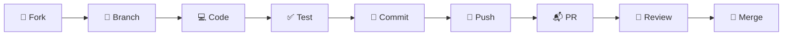

# 🤝 Contributing to C5ISR Zero Trust

Thank you for your interest in contributing to the C5ISR Zero Trust Platform! This document provides guidelines to help you get started.

---

## Table of Contents

- [Code of Conduct](#code-of-conduct)
- [Getting Started](#getting-started)
- [Development Workflow](#development-workflow)
- [Branch Naming](#branch-naming)
- [Commit Messages](#commit-messages)
- [Pull Request Process](#pull-request-process)
- [Code Standards](#code-standards)
- [Architecture Guidelines](#architecture-guidelines)
- [Testing](#testing)
- [Security](#security)

---

## Code of Conduct

By participating in this project, you agree to abide by our [Code of Conduct](CODE_OF_CONDUCT.md). Please read it before contributing.

---

## Getting Started

### 1. Fork & Clone

```bash
# Fork the repository on GitHub, then:
git clone https://github.com/YOUR-USERNAME/cztisr.git
cd cztisr/c5isr-zero-trust
```

### 2. Set Up Development Environment

**Backend:**
```bash
cd backend
python -m venv venv
source venv/bin/activate  # or .\venv\Scripts\activate on Windows
pip install -r requirements.txt
```

**Frontend:**
```bash
cd frontend
npm install
```

### 3. Start Development Servers

```bash
# Option A: Docker (all services)
docker-compose up --build

# Option B: Manual
# Terminal 1: Identity Service
uvicorn identity.main:app --port 8001 --reload

# Terminal 2: Gateway Service
uvicorn gateway.main:app --port 8020 --reload

# Terminal 3: Frontend
cd frontend && npm run dev
```

---

## Development Workflow



1. **Fork** the repository
2. **Create** a feature branch from `main`
3. **Implement** your changes
4. **Test** locally (Docker Compose recommended)
5. **Commit** with conventional messages
6. **Push** to your fork
7. **Open** a Pull Request
8. **Address** review feedback
9. **Merge** (maintainer approves)

---

## Branch Naming

Use the following prefixes:

| Prefix | Use Case | Example |
|:-------|:---------|:--------|
| `feat/` | New feature | `feat/kubernetes-helm-chart` |
| `fix/` | Bug fix | `fix/websocket-reconnect` |
| `docs/` | Documentation | `docs/api-authentication` |
| `refactor/` | Code restructuring | `refactor/policy-engine-modular` |
| `security/` | Security improvement | `security/jwt-key-rotation` |
| `test/` | Test additions | `test/identity-service-unit` |
| `ci/` | CI/CD changes | `ci/github-actions-pipeline` |

---

## Commit Messages

Follow the [Conventional Commits](https://www.conventionalcommits.org/) specification:

```
<type>(<scope>): <description>

[optional body]

[optional footer]
```

### Types

| Type | Description |
|:-----|:------------|
| `feat` | New feature |
| `fix` | Bug fix |
| `docs` | Documentation changes |
| `refactor` | Code restructuring (no behavior change) |
| `security` | Security improvements |
| `test` | Test additions or modifications |
| `ci` | CI/CD pipeline changes |
| `chore` | Maintenance tasks |

### Examples

```
feat(gateway): add rate limiting to API endpoints
fix(identity): handle expired TOTP sessions gracefully
docs(api): add WebSocket protocol documentation
security(auth): implement JWT key rotation mechanism
refactor(frontend): extract RBAC matrix into separate config
```

### Scopes

| Scope | Area |
|:------|:-----|
| `identity` | Identity service / auth |
| `gateway` | Gateway service / API |
| `defense` | Defense service |
| `simulation` | Simulation engine |
| `frontend` | React SPA |
| `auth` | Authentication flow |
| `policy` | Policy engine |
| `docker` | Docker configuration |
| `ci` | GitHub Actions |
| `docs` | Documentation |

---

## Pull Request Process

### PR Checklist

Before submitting a PR, ensure:

- [ ] Code follows the project's style guidelines
- [ ] Changes are tested locally (Docker Compose or manual)
- [ ] Documentation is updated if needed
- [ ] No sensitive data (API keys, secrets) is committed
- [ ] Branch is up to date with `main`
- [ ] PR description explains **what** and **why**

### PR Template

Your PR description should include:

```markdown
## What
Brief description of the changes.

## Why
Motivation and context for the change.

## How
Implementation approach and key decisions.

## Testing
How you tested the changes.

## Screenshots (if UI changes)
Before/after screenshots.
```

---

## Code Standards

### Python (Backend)

- **Formatter:** Follow PEP 8
- **Type hints:** Use Python type annotations
- **Async:** Prefer `async def` for FastAPI endpoints
- **Models:** Use Pydantic `BaseModel` for request/response schemas
- **Imports:** Standard library → third-party → local (separated by blank lines)

```python
# Good
from fastapi import FastAPI, HTTPException
from pydantic import BaseModel
from shared.models import User, ClearanceLevel

async def get_missions() -> dict:
    return {"missions": missions, "total": len(missions)}
```

### TypeScript (Frontend)

- **React:** Functional components with hooks
- **Props:** Use TypeScript interfaces for prop types
- **Naming:** PascalCase for components, camelCase for functions/variables
- **State:** Use `useState` and `useEffect` (no external state libraries)
- **Styling:** Tailwind CSS utility classes

```tsx
// Good
interface DashboardProps {
  token: string;
}

export const Dashboard = ({ token }: DashboardProps) => {
  const [data, setData] = useState<SystemStatus | null>(null);
  // ...
};
```

---

## Architecture Guidelines

When adding new features:

### Adding a New Dashboard Tab

1. Create component in `frontend/src/components/YourComponent.tsx`
2. Add tab definition to `ALL_TABS` array in `App.tsx`
3. Add RBAC permissions to `RBAC_MATRIX` in `App.tsx`
4. Add conditional render in the main content area
5. Wrap panels with `<GlassExpand>` for fullscreen support

### Adding a New API Endpoint

1. Add endpoint to `backend/gateway/main.py`
2. Add audit logging via `log_event()`
3. Document in `docs/API.md`
4. Add policy check if endpoint handles classified data

### Adding a New Backend Service

1. Create directory in `backend/your_service/`
2. Add `main.py`, `Dockerfile`, `__init__.py`
3. Add service to `docker-compose.yml`
4. Add service to `render.yaml` (if deploying to Render)
5. Document in `docs/ARCHITECTURE.md`

---

## Testing

### Manual Testing

```bash
# Start all services
docker-compose up --build

# Test Identity Service
curl http://localhost:8001/health

# Test Gateway Service
curl http://localhost:8020/health

# Test Authentication
curl -X POST http://localhost:8001/auth/step1 \
  -d "username=commander&password=password"

# Test API Endpoint
curl http://localhost:8020/api/system-status

# Test WebSocket (wscat)
npx wscat -c ws://localhost:8020/ws/telemetry
```

### Frontend Testing

```bash
cd frontend
npm run lint      # ESLint checks
npm run build     # TypeScript compilation + build
```

---

## Security

- **Never** commit secrets, API keys, or passwords
- **Never** disable CORS protections without justification
- **Always** validate and sanitize user input
- **Always** use parameterized queries for database access
- **Always** hash passwords with bcrypt
- Report security vulnerabilities via our [Security Policy](SECURITY.md)

---

## Questions?

If you have questions about contributing:

1. Check existing [Issues](https://github.com/Shashivanth009/cztisr/issues)
2. Open a new Discussion
3. Reach out to [@Shashivanth009](https://github.com/Shashivanth009)

---

<div align="center">
  <b>Thank you for helping make C5ISR Zero Trust better! 🛡️</b>
</div>
