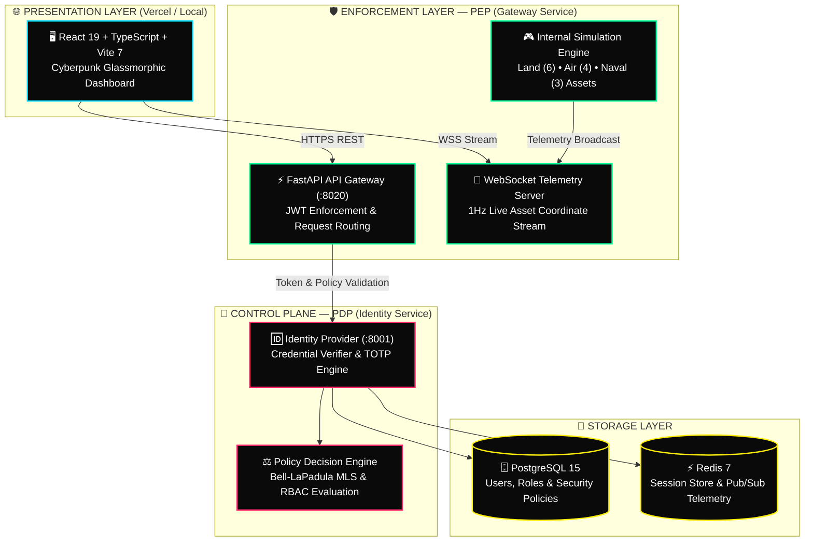

<div align="center">

<!-- CAPSULE HEADER -->


<!-- ANIMATED TYPING HEADER -->
<a href="#-overview">
  
</a>

<br/>

<!-- BADGES -->
<p align="center">
  
  
  
  
</p>

<p align="center">
  
  
  
  
  
  
  
  
</p>

---

</div>

## 🎯 Overview

The **C5ISR Zero Trust Platform** unifies **Combat Systems (C5)**, **Intelligence, Surveillance & Reconnaissance (ISR)**, and **Zero Trust Architecture (ZTA)** into a single, high-intensity command center. Built around the strict **"Never Trust, Always Verify"** standard ([NIST SP 800-207](https://csrc.nist.gov/publications/detail/sp/800-207/final)), every single payload request is subjected to dynamic identity evaluation, TOTP Multi-Factor Authentication, context-aware device trust scoring, and Bell-LaPadula clearance level authorization.

### ⚡ At a Glance
- 🛡️ **3-Step Zero Trust Auth**: Passphrase $\rightarrow$ Contextual Device Trust Evaluation $\rightarrow$ RFC 6238 TOTP MFA.
- 🎛️ **11 Tactical Dashboards**: Complete operational visibility across C1 through C5, ISR modules, and ZTA control panels.
- 📡 **Real-Time Battlespace Telemetry**: Live WebSocket streams delivering updates at 1Hz for ground, aerial, and naval units.
- 🔐 **Bell-LaPadula Multi-Level Security**: Dynamic RBAC & clearance verification (`UNCLASSIFIED` $\rightarrow$ `CONFIDENTIAL` $\rightarrow$ `SECRET` $\rightarrow$ `TOP_SECRET`).
- 🎨 **Glassmorphic Cyberpunk Interface**: Sleek dark UI with neon accents, custom scanline effects, real-time Recharts visualizers, and fullscreen `GlassExpand` panel inspect overlays.
- 🐳 **Full Containerized Stack**: Ready-to-deploy multi-container orchestration via Docker Compose.

---

## 🏗️ System Architecture



---

## 🔐 3-Step Zero Trust Authentication Flow

```mermaid
sequenceDiagram
    autonumber
    actor Operator as 👤 Operator
    participant UI as 🖥️ UI (LoginPage)
    participant IDP as 🔑 Identity Service (PDP)
    participant GW as 🛡️ Gateway (PEP)

    rect rgb(15, 23, 42)
        Note over Operator,IDP: STEP 1 — CREDENTIAL VERIFICATION
        Operator->>UI: Enter Username & Passphrase
        UI->>IDP: POST /auth/step1 (form-urlencoded)
        IDP->>IDP: Check IP Lockout (Max 5 attempts / 300s)
        IDP->>IDP: Verify bcrypt Passphrase Hash
        IDP->>IDP: Evaluate Device Trust Score (Browser, TLS, Hours, Origin)
        IDP-->>UI: Return Session Token + Device Trust Score
    end

    rect rgb(15, 23, 42)
        Note over Operator,UI: STEP 2 — DEVICE TRUST EVALUATION
        UI->>UI: Render Animated Device Trust Score & Risk Factors (2.5s)
    end

    rect rgb(15, 23, 42)
        Note over Operator,IDP: STEP 3 — MULTI-FACTOR AUTHENTICATION (TOTP)
        Operator->>UI: Enter 6-digit Authenticator App Code
        UI->>IDP: POST /auth/step2 (JSON with Session Token)
        IDP->>IDP: Validate TOTP (RFC 6238 pyotp)
        IDP->>IDP: Issue Signed JWT (HS256, 30 min expiration)
        IDP-->>UI: Return Access Token & User Profile
    end

    rect rgb(15, 23, 42)
        Note over UI,GW: AUTHORIZED SESSION
        UI->>GW: REST Request with Bearer JWT
        GW->>IDP: Validate Token & Query Clearance
        GW-->>UI: Serve Authorized Payload
    end
```



---

## ✨ Features & Component Matrix

### 🔴 Combat Systems (C5)

| Module | Component | Tactical Capabilities | Minimum Clearance |
| :--- | :--- | :--- | :---: |
| **C1 — Command** | `CommanderDashboard.tsx` | DEFCON status display, operational unit counters, signal intel ticker, active personnel tracking | `TOP_SECRET` |
| **C2 — Control** | `MissionControl.tsx` | Mission lifecycle CRUD (Plan $\rightarrow$ Active $\rightarrow$ Complete), priority tags, assignment tracking | `TOP_SECRET` |
| **C3 — Computers** | `InfrastructureView.tsx` | Microservice mesh telemetry, CPU/Memory resource monitoring, TLS/mTLS certificate status | `SECRET` |
| **C4 — Comms** | `Communications.tsx` | Encrypted channel management (HF, VHF, SATCOM), secure messaging, transmission latency stats | `SECRET` |
| **C5 — Cyber** | `SOCDashboard.tsx` | Network traffic telemetry, MITRE ATT&CK threat mapping, CVE vulnerability scanner, interactive SOC terminal | `CONFIDENTIAL` |

### 🟢 Intelligence & Reconnaissance (ISR)

| Module | Component | Tactical Capabilities | Minimum Clearance |
| :--- | :--- | :--- | :---: |
| **I — Intelligence** | `Intelligence.tsx` | Multi-INT reports (SIGINT, HUMINT, IMINT, OSINT, ELINT) with dynamic confidence scoring (0-100%) | `SECRET` |
| **S — Surveillance** | `SurveillanceRecon.tsx` | 4 Sensor zones (Ground, Aerial, Naval, Satellite), active sensor counts, alert heatmaps | `CONFIDENTIAL` |
| **R — Reconnaissance** | `SurveillanceRecon.tsx` | UAV (MQ-9 Reaper), Satellite (KH-11), and Ground Team telemetry (speed, fuel, imagery, targets) | `CONFIDENTIAL` |

### 🔵 Zero Trust Architecture (ZTA)

| Module | Component | Tactical Capabilities |
| :--- | :--- | :--- |
| **Policy Engine** | `PolicyEngine.tsx` | Bell-LaPadula MLS rule checker, RBAC role matrix, trust threshold visualizer |
| **Audit Trail** | `AuditLog.tsx` | Immutable access log showing PERMIT/DENY decisions, risk scores (0-95), actor IDs, and timestamps |

---

## 👥 Role-Based Access Control (RBAC) Matrix

| Tab / Module | COMMANDER | SOC_ANALYST | RED_TEAM | SOLDIER |
| :--- | :---: | :---: | :---: | :---: |
| **C1 — Command** | ✅ Authorized | 🔒 Locked | 🔒 Locked | 🔒 Locked |
| **C2 — Control** | ✅ Authorized | 🔒 Locked | 🔒 Locked | 🔒 Locked |
| **C3 — Computers** | ✅ Authorized | ✅ Authorized | 🔒 Locked | 🔒 Locked |
| **C4 — Comms** | ✅ Authorized | ✅ Authorized | 🔒 Locked | 🔒 Locked |
| **C5 — Cyber Def** | ✅ Authorized | ✅ Authorized | ✅ Authorized | 🔒 Locked |
| **I — Intelligence** | ✅ Authorized | ✅ Authorized | 🔒 Locked | 🔒 Locked |
| **S/R — Recon** | ✅ Authorized | 🔒 Locked | ✅ Authorized | 🔒 Locked |
| **Zero Trust** | ✅ Authorized | ✅ Authorized | 🔒 Locked | 🔒 Locked |
| **Audit Log** | ✅ Authorized | ✅ Authorized | 🔒 Locked | 🔒 Locked |
| **Total Tabs** | **9 / 9** | **7 / 9** | **3 / 9** | **0 / 9** |

---

## 🚀 Quick Start

### Prerequisites
- **Docker & Docker Compose** (Recommended) *OR*
- **Node.js** $\ge$ 18 & **Python** $\ge$ 3.11

---

### Option A: Full Stack via Docker Compose (Recommended)

```bash
# 1. Clone the repository
git clone https://github.com/Shashivanth009/cztisr.git
cd cztisr/c5isr-zero-trust

# 2. Build and launch all 6 services
docker-compose up --build
```

Access services locally at:
- 🖥️ **Frontend SPA**: `http://localhost:5173`
- 🛡️ **Gateway Service**: `http://localhost:8020`
- 🔑 **Identity Provider**: `http://localhost:8001`
- 🗄️ **PostgreSQL**: `localhost:5432`
- ⚡ **Redis**: `localhost:6379`

---

### Option B: Manual Local Setup

#### 1. Backend Microservices
```bash
cd backend
pip install -r requirements.txt

# Terminal 1: Identity Service (PDP)
uvicorn identity.main:app --port 8001 --reload

# Terminal 2: Gateway Service (PEP)
uvicorn gateway.main:app --port 8020 --reload
```

#### 2. Frontend React Application
```bash
cd frontend
npm install
npm run dev
```

---

## 🎮 Demo Login Credentials

Try logging in with different operator accounts to test real-time RBAC enforcement & visual tab locks!

| Role | Username | Passphrase | Clearance Level | Accessible Tabs |
| :--- | :--- | :--- | :--- | :---: |
| 🔴 **Commander** | `commander` | `password` | `TOP_SECRET` | **9 / 9** |
| 🟡 **Analyst** | `analyst` | `password` | `SECRET` | **7 / 9** |
| 🟢 **Red Team** | `redteam` | `password` | `CONFIDENTIAL` | **3 / 9** |

> **📲 TOTP MFA Note:** When prompted for your 6-digit TOTP code, scan your QR code via `GET /auth/totp/qr/{username}` or use your configured authenticator app code!

---

## 🌐 Production Deployment

### Backend $\rightarrow$ Render.com
1. Connect your repository to [Render.com](https://render.com).
2. Create a **New Blueprint** — Render will automatically read `render.yaml`.
3. Auto-deploys `c5isr-identity`, `c5isr-gateway`, and `c5isr-postgres`.

### Frontend $\rightarrow$ Vercel
1. Import `frontend/` folder into [Vercel](https://vercel.com).
2. Configure Environment Variables:
   - `VITE_IDENTITY_URL` = `https://your-identity.onrender.com`
   - `VITE_GATEWAY_URL` = `https://your-gateway.onrender.com`
   - `VITE_WS_GATEWAY_URL` = `wss://your-gateway.onrender.com`
3. Deploy SPA.

---

## 📡 API Endpoints Reference Summary

| Method | Endpoint | Description | Layer |
| :---: | :--- | :--- | :---: |
| `POST` | `/auth/step1` | Credential verification & Device Trust check | PDP |
| `POST` | `/auth/step2` | TOTP verification & JWT token generation | PDP |
| `GET` | `/auth/totp/qr/{username}` | Returns TOTP QR code PNG for enrollment | PDP |
| `POST` | `/policy/evaluate` | Evaluates Bell-LaPadula & RBAC decisions | PDP |
| `GET` | `/api/system-status` | Overview metrics (DEFCON, active threats, missions) | PEP |
| `GET` | `/api/missions` | Active mission list & progress statistics | PEP |
| `GET` | `/api/infrastructure` | Microservice health, memory/CPU & encryption status | PEP |
| `GET` | `/api/communications` | HF/VHF/SATCOM channel telemetry & encrypted log | PEP |
| `GET` | `/api/threats` | Active MITRE ATT&CK cyber threat intelligence | PEP |
| `GET` | `/api/intelligence` | SIGINT/HUMINT/IMINT/OSINT/ELINT reports | PEP |
| `GET` | `/api/surveillance` | Sensor zone coverage & alert heatmaps | PEP |
| `GET` | `/api/reconnaissance` | UAV & satellite flight paths & fuel reserves | PEP |
| `GET` | `/api/audit-logs` | Immutable security log trail (PERMIT/DENY) | PEP |
| `WS` | `/ws/telemetry` | Real-time WebSocket battle map asset stream (1Hz) | PEP |

---

<div align="center">


**Built with 🛡️ by [Shashivanth](https://github.com/Shashivanth009)**

<sub>NIST SP 800-207 • Bell-LaPadula MLS • RFC 6238 TOTP • mTLS 1.3</sub>

</div>
