```mermaid
graph LR
    subgraph ISR["🟢 ISR — INTEL & RECON"]
        direction TB
        I["🔍 I — INTELLIGENCE<br/>Intelligence.tsx"]
        S["👁️ S — SURVEILLANCE<br/>SurveillanceRecon.tsx"]
        R["🎯 R — RECON<br/>SurveillanceRecon.tsx"]
    end

    I --> |"SIGINT / HUMINT<br/>IMINT / OSINT / ELINT"| DATA
    S --> |"Sensor Zones<br/>Coverage Maps"| DATA
    R --> |"UAV / Satellite<br/>Ground Assets"| DATA

    DATA["📊 Data Layer"]

    style ISR fill:#0a1a0a,stroke:#00ff9d,stroke-width:2px
    style DATA fill:#0a0a1a,stroke:#00d9f9,stroke-width:2px
```

<!-- 
  ╔══════════════════════════════════════════════════════════════╗
  ║              C5ISR ZERO TRUST PLATFORM                       ║
  ║         Military-Grade Command & Control Dashboard           ║
  ║          Secured by Zero Trust Architecture                  ║
  ╚══════════════════════════════════════════════════════════════╝
-->

<div align="center">

<!-- ═══════════════════ ANIMATED HERO BANNER ═══════════════════ -->



<br/>

<!-- ═══════════════════ ANIMATED TITLE ═══════════════════ -->

<picture>
  <source media="(prefers-color-scheme: dark)" srcset="docs/assets/title-dark.svg">
  <source media="(prefers-color-scheme: light)" srcset="docs/assets/title-light.svg">
  
</picture>

<br/>

<!-- Animated Typing Effect -->
<a href="#-overview">
  
</a>

<br/>

<!-- ═══════════════════ STATUS BADGES ═══════════════════ -->

<!-- Row 1: Build & Deploy -->
<p>
  <a href="https://github.com/Shashivanth009/cztisr/actions"></a>
  <a href="https://cztisr.vercel.app"></a>
  <a href="https://github.com/Shashivanth009/cztisr/blob/main/LICENSE"></a>
  <a href="#-security-model"></a>
</p>

<!-- Row 2: Tech Stack -->
<p>
  
  
  
  
  
  
  
  
  
</p>

<!-- Row 3: Metrics -->
<p>
  
  
  
  
  
</p>

<br/>

<!-- ═══════════════════ NAVIGATION ═══════════════════ -->

<table>
<tr>
<td align="center"><a href="#-overview"><b>📋 Overview</b></a></td>
<td align="center"><a href="#-live-demo"><b>🎮 Live Demo</b></a></td>
<td align="center"><a href="#-architecture"><b>🏗️ Architecture</b></a></td>
<td align="center"><a href="#-features"><b>✨ Features</b></a></td>
<td align="center"><a href="#-quick-start"><b>🚀 Quick Start</b></a></td>
<td align="center"><a href="#-security-model"><b>🔒 Security</b></a></td>
</tr>
<tr>
<td align="center"><a href="#-api-reference"><b>📡 API</b></a></td>
<td align="center"><a href="docs/ARCHITECTURE.md"><b>📐 Docs</b></a></td>
<td align="center"><a href="CONTRIBUTING.md"><b>🤝 Contribute</b></a></td>
<td align="center"><a href="#-deployment"><b>🌐 Deploy</b></a></td>
<td align="center"><a href="#-tech-stack"><b>🛠️ Stack</b></a></td>
<td align="center"><a href="#-roadmap"><b>🗺️ Roadmap</b></a></td>
</tr>
</table>

</div>

<br/>

<!-- ═══════════════════ HERO SEPARATOR ═══════════════════ -->


<br/>

## 🎯 Overview

<table>
<tr>
<td width="60%">

**C5ISR Zero Trust Platform** is a real-time military command & control dashboard that unifies **Combat Systems (C5)**, **Intelligence, Surveillance & Reconnaissance (ISR)**, and **Zero Trust Architecture (ZTA)** into a single-pane-of-glass command interface.

Built on the **"Never Trust, Always Verify"** principle ([NIST SP 800-207](https://csrc.nist.gov/publications/detail/sp/800-207/final)), every API request is authenticated with **JWT + TOTP MFA**, authorized through **Bell-LaPadula** clearance checks and **RBAC** policies, and immutably logged for forensic audit.

### ⚡ Key Highlights

- **🛡️ 3-Step Zero Trust Auth** — Credentials → Device Trust → TOTP MFA
- **📊 11 Dashboard Modules** — C1 through C5, ISR, and ZTA panels
- **🔴 Real-Time Telemetry** — WebSocket-driven asset tracking with sub-second updates
- **🧬 Bell-LaPadula Model** — Mandatory Access Control with 4 clearance tiers
- **🎨 Cyberpunk UI** — Glassmorphic dark theme with neon accents and scanline effects
- **🐳 6-Container Stack** — Full Docker Compose orchestration

</td>
<td width="40%">

```
╔══════════════════════════════╗
║    SYSTEM STATUS: ONLINE     ║
╠══════════════════════════════╣
║  DEFCON LEVEL    ▸ 3         ║
║  ZERO TRUST      ▸ ACTIVE    ║
║  ENCRYPTION      ▸ AES-256   ║
║  AUTH METHOD     ▸ TOTP MFA  ║
║  CLEARANCE TIERS ▸ 4         ║
║  ACTIVE SERVICES ▸ 6         ║
║  POLICY ENGINE   ▸ ARMED     ║
║  AUDIT LOG       ▸ RECORDING ║
║  THREAT LEVEL    ▸ ELEVATED  ║
╠══════════════════════════════╣
║  ● ALL SYSTEMS OPERATIONAL   ║
╚══════════════════════════════╝
```

</td>
</tr>
</table>

<br/>


## 🎮 Live Demo

<table>
<tr>
<td>

| Credential | Username | Password | Clearance | Tabs |
|:---:|:---:|:---:|:---:|:---:|
| 🔴 **Commander** | `commander` | `password` | `TOP_SECRET` | **9/9** |
| 🟡 **Analyst** | `analyst` | `password` | `SECRET` | **7/9** |
| 🟢 **Red Team** | `redteam` | `password` | `CONFIDENTIAL` | **3/9** |

</td>
<td>

> **🔐 MFA Required** — After entering credentials, open your **TOTP Authenticator App** (Google Authenticator, Authy, etc.) and enter the 6-digit code.
>
> **📲 First time?** Visit the QR enrollment endpoint to register your authenticator:
> ```
> GET /auth/totp/qr/{username}
> ```

</td>
</tr>
</table>

> [!TIP]
> Each role sees a **different dashboard** — locked tabs show a red `ACCESS DENIED` flash, demonstrating real-time RBAC enforcement in the UI.

<br/>


## ✨ Features

```mermaid
graph LR
    subgraph C5["🔴 C5 — COMBAT SYSTEMS"]
        direction TB
        C1["🎖️ C1 — COMMAND<br/>CommanderDashboard.tsx"]
        C2["🎯 C2 — CONTROL<br/>MissionControl.tsx"]
        C3["🖥️ C3 — COMPUTERS<br/>InfrastructureView.tsx"]
        C4["📡 C4 — COMMS<br/>Communications.tsx"]
        C5_["🛡️ C5 — CYBER DEF<br/>SOCDashboard.tsx"]
    end

    C1 --> |"DEFCON Status<br/>Asset Tracking<br/>Signal Intel"| GATEWAY
    C2 --> |"Mission CRUD<br/>Lifecycle Mgmt"| GATEWAY
    C3 --> |"Service Mesh<br/>CPU/MEM Stats"| GATEWAY
    C4 --> |"Encrypted Comms<br/>Protocol Mgmt"| GATEWAY
    C5_ --> |"Threat Intel<br/>SOC Terminal"| GATEWAY

    GATEWAY["🔒 Gateway PEP"]

    style C5 fill:#1a0a0a,stroke:#ff2a6d,stroke-width:2px
    style GATEWAY fill:#0a1a0a,stroke:#00ff9d,stroke-width:2px
```

<!-- ═══════════════════ C5 COMBAT SYSTEMS ═══════════════════ -->

<details open>
<summary><h3>🔴 C5 — Combat Systems</h3></summary>

<br/>



| Module | Component | Capabilities | Clearance |
|:------:|:---------:|:-------------|:---------:|
| **C1 — Command** | `CommanderDashboard` | DEFCON status, live asset count, signal intel feed, personnel tracking | `TOP_SECRET` |
| **C2 — Control** | `MissionControl` | Mission lifecycle (Plan → Active → Complete), priority & classification labels | `TOP_SECRET` |
| **C3 — Computers** | `InfrastructureView` | Service mesh health, CPU/MEM metrics, encryption status, certificate tracking | `SECRET` |
| **C4 — Comms** | `Communications` | Encrypted channel management (HF/VHF/SATCOM), secure messaging, protocol badges | `SECRET` |
| **C5 — Cyber** | `SOCDashboard` | Network traffic analysis, MITRE ATT&CK mapping, vulnerability scan, SOC terminal | `CONFIDENTIAL` |

</details>

<!-- ═══════════════════ ISR ═══════════════════ -->

<details open>
<summary><h3>🟢 ISR — Intelligence, Surveillance & Reconnaissance</h3></summary>

<br/>



| Module | Component | Capabilities | Clearance |
|:------:|:---------:|:-------------|:---------:|
| **I — Intel** | `Intelligence` | SIGINT/HUMINT/IMINT/OSINT/ELINT reports with confidence scoring (0–100%) | `SECRET` |
| **S — Surveillance** | `SurveillanceRecon` | 4 sensor zones (Ground/Aerial/Naval/Satellite), 48 sensors, coverage heatmaps | `CONFIDENTIAL` |
| **R — Recon** | `SurveillanceRecon` | MQ-9 Reaper UAV, KH-11 Satellite, Ground Teams — fuel, imagery & target stats | `CONFIDENTIAL` |

</details>

<!-- ═══════════════════ ZTA ═══════════════════ -->

<details open>
<summary><h3>🔵 ZTA — Zero Trust Architecture</h3></summary>

<br/>



```mermaid
graph TD
    subgraph ZTA["🔵 ZERO TRUST ARCHITECTURE"]
        PE["⚖️ Policy Engine<br/>PolicyEngine.tsx"]
        AL["📜 Audit Log<br/>AuditLog.tsx"]
    end

    PE --> |"Bell-LaPadula<br/>RBAC Rules<br/>Trust Scoring"| DECISIONS
    AL --> |"Immutable Log<br/>PERMIT/DENY"| DECISIONS

    DECISIONS["✅❌ Access Decisions"]

    style ZTA fill:#0a0a1a,stroke:#00d9f9,stroke-width:2px
    style DECISIONS fill:#1a0a1a,stroke:#ff2a6d,stroke-width:2px
```

| Module | Component | Capabilities |
|:------:|:---------:|:-------------|
| **Policy Engine** | `PolicyEngine` | Bell-LaPadula (No Read Up), 4 RBAC rules, clearance hierarchy visualization, trust score threshold |
| **Audit Trail** | `AuditLog` | Immutable PERMIT/DENY log with timestamps, actor tracking, risk scores (0–95), auto-refresh |

</details>

<!-- ═══════════════════ UI/UX ═══════════════════ -->

<details>
<summary><h3>🎨 UI/UX — Cyberpunk Glassmorphic Design</h3></summary>

<br/>

| Feature | Description |
|:--------|:------------|
| **Glassmorphic Panels** | Dark glass UI with `backdrop-blur-sm`, neon borders (`#00ff9d`, `#00d9f9`, `#ff2a6d`) |
| **GlassExpand** | Click any panel → fullscreen overlay with scanline effect, ESC to close |
| **Framer Motion** | Smooth component transitions and animated mount/unmount |
| **Recharts** | Line, Pie, and Bar visualizations for threat data, network stats, policy decisions |
| **Real-Time Map** | WebSocket-driven asset map with `ThreatMap.tsx` — Land/Air/Naval units updated every 1s |
| **RBAC Visual Lock** | Denied tabs show with strikethrough + lock icon, clicking triggers red ACCESS DENIED flash |
| **Radar Animation** | Login page features concentric animated radar circles |
| **Custom Scrollbar** | Styled scrollbar matching the cyberpunk theme |

**Color Palette:**
```
┌──────────────────────────────────────────┐
│  #00ff9d  ██████  Primary (Neon Green)   │
│  #00d9f9  ██████  Secondary (Cyber Blue) │
│  #ff2a6d  ██████  Alert (Threat Red)     │
│  #fcee0a  ██████  Warning (Yellow)       │
│  #0a0a0a  ██████  Background (Dark)      │
│  #1e293b  ██████  Slate (Grid/Border)    │
└──────────────────────────────────────────┘
```

</details>

<br/>


## 🏗️ Architecture

```mermaid
%%{init: {'theme': 'dark', 'themeVariables': {'primaryColor': '#00ff9d', 'primaryTextColor': '#ffffff', 'primaryBorderColor': '#00ff9d', 'lineColor': '#00d9f9', 'secondaryColor': '#0a0e1a', 'tertiaryColor': '#1e293b'}}}%%

flowchart TB
    subgraph CLIENT["🌐 CLIENT LAYER"]
        BROWSER["🖥️ React 19 SPA<br/>Vite 7 • TypeScript<br/>Tailwind • Framer Motion"]
    end

    subgraph ENFORCEMENT["🔒 ENFORCEMENT LAYER (PEP)"]
        GATEWAY["🛡️ Gateway Service<br/>FastAPI • JWT Validation<br/>Policy Enforcement Point"]
        WS["📡 WebSocket Server<br/>/ws/telemetry<br/>Real-Time Asset Stream"]
        SIM["🎮 Embedded Simulator<br/>Land (6) • Air (4) • Naval (3)<br/>Physics Tick: 1Hz"]
        TRAFFIC["📊 Traffic Generator<br/>Audit Event Simulation<br/>90% Valid / 10% Threats"]
    end

    subgraph CONTROL["🔑 CONTROL PLANE (PDP)"]
        IDENTITY["🆔 Identity Service<br/>Auth • JWT • TOTP MFA<br/>User Management"]
        POLICY["⚖️ Policy Engine<br/>Bell-LaPadula • RBAC<br/>Trust Scoring"]
    end

    subgraph DATA["💾 DATA LAYER"]
        POSTGRES["🗄️ PostgreSQL 15<br/>Users • Roles • Policies"]
        REDIS["⚡ Redis 7<br/>Sessions • Pub/Sub"]
    end

    subgraph SERVICES["🔧 SERVICE LAYER"]
        DEFENSE["🛡️ Cyber Defense<br/>Threat Intel DB<br/>Network Stats"]
        SIMULATION["🎮 Simulation Engine<br/>Redis Pub/Sub<br/>Asset Physics"]
    end

    BROWSER -->|"HTTPS REST"| GATEWAY
    BROWSER -->|"WSS"| WS
    GATEWAY -->|"Token Verify"| IDENTITY
    GATEWAY -->|"Policy Check"| POLICY
    IDENTITY --> POSTGRES
    IDENTITY --> REDIS
    DEFENSE --> POSTGRES
    SIMULATION -->|"Pub/Sub"| REDIS
    SIM -->|"Broadcast"| WS

    style CLIENT fill:#0d1117,stroke:#00d9f9,stroke-width:2px
    style ENFORCEMENT fill:#0d1117,stroke:#00ff9d,stroke-width:2px
    style CONTROL fill:#0d1117,stroke:#ff2a6d,stroke-width:2px
    style DATA fill:#0d1117,stroke:#fcee0a,stroke-width:2px
    style SERVICES fill:#0d1117,stroke:#94a3b8,stroke-width:2px
```

<!-- ═══════════════════ HIGH-LEVEL ARCH ═══════════════════ -->



> **PEP** = Policy Enforcement Point &nbsp;|&nbsp; **PDP** = Policy Decision Point &nbsp;|&nbsp; Based on [NIST SP 800-207](https://csrc.nist.gov/publications/detail/sp/800-207/final)

<br/>

<!-- ═══════════════════ AUTH FLOW ═══════════════════ -->

### 🔐 Zero Trust Authentication Flow

```mermaid
sequenceDiagram
    autonumber
    participant U as 👤 Operator
    participant F as 🖥️ Frontend
    participant I as 🆔 Identity (PDP)
    participant G as 🛡️ Gateway (PEP)

    rect rgb(10, 14, 26)
        Note over U,I: STEP 1 — Credential Verification
        U->>F: Enter username + password
        F->>I: POST /auth/step1 (form-urlencoded)
        I->>I: Check lockout (5 attempts / 300s)
        I->>I: Verify bcrypt hash
        I->>I: Evaluate device trust score
        I-->>F: session_token + device_trust + user_info
    end

    rect rgb(10, 26, 14)
        Note over U,I: STEP 2 — Device Trust Evaluation
        F->>F: Display trust score animation
        F->>F: Show factor breakdown (Browser, TLS, Hours, Origin)
        Note right of F: Auto-advances after 2.5s
    end

    rect rgb(26, 10, 14)
        Note over U,I: STEP 3 — TOTP Multi-Factor Auth
        U->>F: Enter 6-digit TOTP code
        F->>I: POST /auth/step2 (JSON)
        I->>I: Verify TOTP (pyotp, valid_window=1)
        I->>I: Clear failed attempts
        I->>I: Create JWT (HS256, 30min TTL)
        I-->>F: access_token + user profile
    end

    rect rgb(10, 14, 26)
        Note over F,G: AUTHORIZED SESSION
        F->>G: GET /api/* (Bearer token)
        G->>I: GET /users/me (token verify)
        I-->>G: User profile + clearance
        G->>G: Policy evaluation (RBAC + clearance)
        G-->>F: API response (data)
        F->>G: WSS /ws/telemetry
        G-->>F: Real-time asset telemetry (1Hz)
    end
```



<br/>

### 📐 Detailed Architecture Docs

> 📖 See **[docs/ARCHITECTURE.md](docs/ARCHITECTURE.md)** for the complete architecture deep-dive including:
> - Service interaction matrix
> - Data flow diagrams
> - Security boundary analysis
> - WebSocket telemetry protocol

<br/>


## 🛠️ Tech Stack

<table>
<tr><td colspan="3" align="center"><b>🖥️ FRONTEND</b></td></tr>
<tr>
<td> <b>React 19</b></td>
<td>Component-based UI with Hooks</td>
<td><code>react@^19.2.0</code></td>
</tr>
<tr>
<td> <b>TypeScript 5.9</b></td>
<td>Type-safe development</td>
<td><code>typescript@~5.9.3</code></td>
</tr>
<tr>
<td> <b>Vite 7</b></td>
<td>Lightning-fast dev server & builds</td>
<td><code>vite@^7.3.1</code></td>
</tr>
<tr>
<td> <b>TailwindCSS 3</b></td>
<td>Utility-first with cyberpunk theme</td>
<td><code>tailwindcss@^3.4.1</code></td>
</tr>
<tr>
<td>🎬 <b>Framer Motion 12</b></td>
<td>GlassExpand animations & transitions</td>
<td><code>framer-motion@^12.34.0</code></td>
</tr>
<tr>
<td>📊 <b>Recharts 3</b></td>
<td>Line, Pie, Bar chart visualizations</td>
<td><code>recharts@^3.7.0</code></td>
</tr>
<tr>
<td>🎖️ <b>Lucide React</b></td>
<td>Military-grade iconography</td>
<td><code>lucide-react@^0.564.0</code></td>
</tr>
</table>

<table>
<tr><td colspan="3" align="center"><b>⚙️ BACKEND</b></td></tr>
<tr>
<td> <b>FastAPI 0.109</b></td>
<td>Async REST + WebSocket framework</td>
<td><code>fastapi==0.109.0</code></td>
</tr>
<tr>
<td>📋 <b>Pydantic 2.6</b></td>
<td>Request/Response validation</td>
<td><code>pydantic==2.6.0</code></td>
</tr>
<tr>
<td>🔑 <b>python-jose</b></td>
<td>JWT creation & verification (HS256)</td>
<td><code>python-jose==3.3.0</code></td>
</tr>
<tr>
<td>🔒 <b>passlib + bcrypt</b></td>
<td>Secure password hashing</td>
<td><code>passlib==1.7.4</code>, <code>bcrypt==4.0.1</code></td>
</tr>
<tr>
<td>📱 <b>pyotp + qrcode</b></td>
<td>TOTP MFA (RFC 6238)</td>
<td><code>pyotp==2.9.0</code>, <code>qrcode==7.4.2</code></td>
</tr>
<tr>
<td>🔗 <b>httpx</b></td>
<td>Async inter-service communication</td>
<td><code>httpx==0.26.0</code></td>
</tr>
<tr>
<td>🗄️ <b>SQLAlchemy + asyncpg</b></td>
<td>Async PostgreSQL ORM</td>
<td><code>sqlalchemy==2.0.25</code></td>
</tr>
</table>

<table>
<tr><td colspan="3" align="center"><b>🏗️ INFRASTRUCTURE</b></td></tr>
<tr>
<td> <b>Docker Compose</b></td>
<td>6-container orchestration</td>
<td><code>docker-compose.yml</code></td>
</tr>
<tr>
<td>☁️ <b>Render.com</b></td>
<td>Backend hosting (IaC Blueprint)</td>
<td><code>render.yaml</code></td>
</tr>
<tr>
<td>▲ <b>Vercel</b></td>
<td>Frontend SPA hosting</td>
<td><code>vercel.json</code></td>
</tr>
<tr>
<td> <b>PostgreSQL 15</b></td>
<td>Persistent data store</td>
<td>Alpine image</td>
</tr>
<tr>
<td> <b>Redis 7</b></td>
<td>Sessions & Pub/Sub telemetry</td>
<td>Alpine image</td>
</tr>
</table>

<br/>


## 📁 Project Structure

```
c5isr-zero-trust/
│
├── 📂 backend/                          # Python microservices
│   ├── 📂 identity/                     # 🔑 Layer 0/1 — Identity Provider (PDP)
│   │   ├── main.py                      #    Auth endpoints, JWT, TOTP MFA, device trust
│   │   ├── policy_engine.py             #    Bell-LaPadula, RBAC, trust scoring
│   │   └── Dockerfile                   #    Python 3.10-slim container
│   │
│   ├── 📂 gateway/                      # 🛡️ Layer 2 — Policy Enforcement Point (PEP)
│   │   ├── main.py                      #    REST APIs (16 endpoints), WebSocket, embedded sim
│   │   └── Dockerfile                   #    Python 3.10-slim container
│   │
│   ├── 📂 defense/                      # 🔰 Layer 3 — Cyber Defense Module
│   │   ├── main.py                      #    Threat intel DB, network stats, vuln scanning
│   │   └── Dockerfile
│   │
│   ├── 📂 simulation/                   # 🎮 Layer 3 — Asset Simulation Engine
│   │   ├── main.py                      #    Land/Air/Naval physics sim (Redis pub/sub)
│   │   └── Dockerfile
│   │
│   ├── 📂 shared/                       # 📦 Shared models
│   │   └── models.py                    #    User, UserRole, ClearanceLevel, TrustScore
│   │
│   └── requirements.txt                 # 16 Python packages
│
├── 📂 frontend/                         # React SPA
│   ├── 📂 src/
│   │   ├── 📂 components/               # 11 Dashboard modules
│   │   │   ├── CommanderDashboard.tsx    #    C1 — DEFCON, assets, signal intel
│   │   │   ├── MissionControl.tsx       #    C2 — Mission lifecycle CRUD
│   │   │   ├── InfrastructureView.tsx   #    C3 — Service mesh, certs, encryption
│   │   │   ├── Communications.tsx       #    C4 — Encrypted channels, messaging
│   │   │   ├── SOCDashboard.tsx         #    C5 — Threats, network, SOC terminal
│   │   │   ├── Intelligence.tsx         #    I  — Intel reports (5 SIGINT types)
│   │   │   ├── SurveillanceRecon.tsx    #    S/R — Sensors, UAVs, satellite recon
│   │   │   ├── ThreatMap.tsx            #    Live WebSocket battlespace map
│   │   │   ├── PolicyEngine.tsx         #    ZTA — Policy rules, clearance viz
│   │   │   ├── AuditLog.tsx             #    ZTA — Immutable access trail
│   │   │   └── GlassExpand.tsx          #    Fullscreen overlay with Portal
│   │   │
│   │   ├── 📂 pages/
│   │   │   └── LoginPage.tsx            #    3-step Zero Trust auth UI
│   │   │
│   │   ├── App.tsx                      #    Main app, 9-tab nav, RBAC matrix
│   │   └── config.ts                    #    Centralized API endpoint config
│   │
│   ├── tailwind.config.js               # Cyberpunk color palette
│   ├── package.json                     # 7 dependencies + 12 dev deps
│   └── vercel.json                      # SPA routing for Vercel
│
├── 📂 docs/                             # 📖 Documentation
│   ├── ARCHITECTURE.md                  #    Deep-dive architecture guide
│   ├── API.md                           #    Complete API reference
│   ├── DEPLOYMENT.md                    #    Deployment guide (Docker/Render/Vercel)
│   └── 📂 assets/                       #    SVG diagrams and branding
│
├── 📂 .github/                          # GitHub config
│   ├── 📂 workflows/                    #    CI/CD pipelines
│   └── 📂 ISSUE_TEMPLATE/              #    Bug/feature/security templates
│
├── docker-compose.yml                   # 6-service orchestration
├── render.yaml                          # Render.com IaC blueprint
├── CONTRIBUTING.md                      # Contribution guide
├── SECURITY.md                          # Security policy
├── CODE_OF_CONDUCT.md                   # Community standards
└── LICENSE                              # MIT License
```

<br/>


## 🚀 Quick Start

### Prerequisites

| Tool | Version | Purpose |
|:----:|:-------:|:--------|
| 🐳 Docker | Latest | Container runtime |
| 🐙 Docker Compose | v2+ | Multi-service orchestration |
| 📦 Node.js | ≥ 18 | Frontend development (manual mode) |
| 🐍 Python | ≥ 3.11 | Backend development (manual mode) |

### Option A: Docker Compose (Recommended)

```bash
# Clone the repository
git clone https://github.com/Shashivanth009/cztisr.git
cd cztisr/c5isr-zero-trust

# 🐳 Start all 6 services
docker-compose up --build

# ✅ Services ready at:
#    Frontend   →  http://localhost:5173
#    Gateway    →  http://localhost:8020
#    Identity   →  http://localhost:8001
#    PostgreSQL →  localhost:5432
#    Redis      →  localhost:6379
```

### Option B: Manual Development Setup

<details>
<summary><b>🐍 Backend (Identity + Gateway)</b></summary>

```bash
# Navigate to backend
cd backend

# Create virtual environment
python -m venv venv
source venv/bin/activate  # Linux/Mac
.\venv\Scripts\activate   # Windows

# Install dependencies
pip install -r requirements.txt

# Start Identity Service (Terminal 1)
uvicorn identity.main:app --port 8001 --reload

# Start Gateway Service (Terminal 2)
uvicorn gateway.main:app --port 8020 --reload
```

</details>

<details>
<summary><b>⚛️ Frontend (React SPA)</b></summary>

```bash
# Navigate to frontend
cd frontend

# Install dependencies
npm install

# Start dev server
npm run dev

# Open http://localhost:5173
```

</details>

<br/>

### 🐳 Docker Service Map

```mermaid
graph LR
    subgraph DOCKER["🐳 Docker Compose (6 Containers)"]
        PG["🗄️ postgres<br/>:5432"]
        RD["⚡ redis<br/>:6379"]
        ID["🆔 identity<br/>:8001→8000"]
        GW["🛡️ gateway<br/>:8020→8000"]
        DF["🔰 defense"]
        SM["🎮 simulation"]
    end

    PG --> ID
    RD --> ID
    RD --> GW
    ID --> GW
    GW --> DF
    GW --> SM
    SM --> RD

    style DOCKER fill:#0d1117,stroke:#2496ED,stroke-width:2px
```



<br/>


## 🔒 Security Model

### Zero Trust Policy Engine

```mermaid
%%{init: {'theme': 'dark'}}%%
flowchart TD
    REQ["🔑 Access Request<br/>(Subject + Resource + Action)"]

    REQ --> BLP["📜 Bell-LaPadula<br/>No Read Up"]
    REQ --> RBAC["👥 RBAC Check<br/>Role-Based"]
    REQ --> TRUST["📊 Trust Score<br/>Device + Context + Time"]

    BLP --> |"UNCLASS < CONF < SECRET < TS"| EVAL
    RBAC --> |"COMMANDER, SOC_ANALYST,<br/>SOLDIER, RED_TEAM"| EVAL
    TRUST --> |"Score 0-100<br/>Threshold: 40"| EVAL

    EVAL{"⚖️ Decision Engine"}

    EVAL -->|"All Checks Pass"| PERMIT["✅ PERMIT<br/>+ Audit Log"]
    EVAL -->|"Any Check Fails"| DENY["❌ DENY<br/>+ Audit Log + Alert"]

    style REQ fill:#0a0e1a,stroke:#00d9f9,stroke-width:2px
    style BLP fill:#0a0e1a,stroke:#ff2a6d,stroke-width:2px
    style RBAC fill:#0a0e1a,stroke:#00ff9d,stroke-width:2px
    style TRUST fill:#0a0e1a,stroke:#fcee0a,stroke-width:2px
    style PERMIT fill:#0a1a0a,stroke:#00ff9d,stroke-width:3px
    style DENY fill:#1a0a0a,stroke:#ff2a6d,stroke-width:3px
```



### Clearance Hierarchy (Bell-LaPadula)

```
┌─────────────────────────────────────────────────────────────┐
│                    CLEARANCE HIERARCHY                       │
│              (Bell-LaPadula: No Read Up)                    │
│                                                              │
│  Level 3  ██████████████████████████  TOP_SECRET    🔴      │
│  Level 2  ████████████████████        SECRET        🟡      │
│  Level 1  ████████████                CONFIDENTIAL  🔵      │
│  Level 0  ██████                      UNCLASSIFIED  ⚪      │
│                                                              │
│  Rule: subject.clearance >= resource.classification         │
│  Violation → DENY + Audit Alert (risk_score: 60-95)        │
└─────────────────────────────────────────────────────────────┘
```

### Security Features

| Feature | Implementation | Details |
|:--------|:---------------|:--------|
| **Authentication** | JWT (HS256) | 30-min TTL, `python-jose` |
| **MFA** | TOTP (RFC 6238) | `pyotp` with `valid_window=1` for clock drift |
| **Password Hashing** | bcrypt | `passlib` with auto-deprecation |
| **Brute Force Protection** | Rate limiting | 5 attempts → 300s lockout per IP:user |
| **Device Trust** | Context scoring | Browser, TLS, hours, origin (0–100 score) |
| **Transport** | HTTPS/WSS | mTLS 1.3, AES-256-GCM |
| **Audit** | Immutable log | Every PERMIT/DENY with risk score & actor |
| **RBAC** | Frontend + Backend | 9 tabs × 4 roles matrix, enforced both sides |

> [!WARNING]
> **Demo Credentials**: The default passwords are `password` for all users. In production, use strong, unique passphrases and store TOTP secrets in an encrypted vault (e.g., HashiCorp Vault, AWS Secrets Manager).

<br/>


## 📡 API Reference

### Identity Service (`:8001`)

| Method | Endpoint | Description | Auth |
|:------:|:---------|:------------|:----:|
| `POST` | `/auth/step1` | Credential verification → session token | ❌ |
| `POST` | `/auth/step2` | TOTP MFA verification → JWT | ❌ |
| `POST` | `/token` | Legacy single-step auth (no MFA) | ❌ |
| `GET` | `/users/me` | Current user profile | 🔐 |
| `GET` | `/auth/totp/qr/{username}` | QR code for authenticator enrollment | ❌ |
| `GET` | `/auth/sessions` | Active session list | ❌ |
| `GET` | `/auth/audit` | Authentication audit trail | ❌ |
| `POST` | `/policy/evaluate` | Policy Decision Point evaluation | ❌ |
| `GET` | `/health` | Service health check | ❌ |

### Gateway Service (`:8020`)

| Method | Endpoint | Description | Auth |
|:------:|:---------|:------------|:----:|
| `GET` | `/api/system-status` | DEFCON, missions, threats, personnel | ❌ |
| `GET` | `/api/missions` | Active mission list with progress | ❌ |
| `POST` | `/api/missions/{id}/update` | Update mission status | ❌ |
| `GET` | `/api/infrastructure` | Service mesh, certs, encryption | ❌ |
| `GET` | `/api/communications` | Channel status (HF/VHF/SATCOM) | ❌ |
| `POST` | `/api/communications/send` | Send encrypted message | ❌ |
| `GET` | `/api/threats` | Active threats (MITRE ATT&CK) | ❌ |
| `GET` | `/api/network-stats` | Bandwidth, connections, protocols | ❌ |
| `GET` | `/api/vulnerability-scan` | CVE findings & compliance | ❌ |
| `GET` | `/api/intelligence` | Intel reports (5 SIGINT types) | ❌ |
| `GET` | `/api/surveillance` | Sensor zone data & coverage | ❌ |
| `GET` | `/api/reconnaissance` | UAV/Satellite/Ground assets | ❌ |
| `GET` | `/api/policy-decisions` | Policy evaluation history | ❌ |
| `GET` | `/api/audit-logs` | Immutable access trail | ❌ |
| `WS` | `/ws/telemetry` | Real-time asset position stream | ❌ |
| `GET` | `/health` | Service health check | ❌ |

> 📖 See **[docs/API.md](docs/API.md)** for full request/response schemas and example payloads.

<br/>


## 🌐 Deployment

### Backend → Render.com

```mermaid
graph LR
    GH["📦 GitHub Repo"] -->|"render.yaml"| RB["☁️ Render Blueprint"]
    RB --> PG["🗄️ c5isr-postgres<br/>Free Plan"]
    RB --> ID["🆔 c5isr-identity<br/>Docker"]
    RB --> GW["🛡️ c5isr-gateway<br/>Docker"]

    style GH fill:#0d1117,stroke:#00ff9d
    style RB fill:#0d1117,stroke:#00d9f9
```



1. Push code to GitHub
2. Create **New Blueprint** on [Render.com](https://render.com)
3. Connect your repo — auto-detects `render.yaml`
4. Services created: `c5isr-identity`, `c5isr-gateway`, `c5isr-postgres`

### Frontend → Vercel

1. Import from GitHub on [Vercel](https://vercel.com)
2. Set **Environment Variables**:

| Variable | Value |
|:---------|:------|
| `VITE_IDENTITY_URL` | `https://your-identity.onrender.com` |
| `VITE_GATEWAY_URL` | `https://your-gateway.onrender.com` |
| `VITE_WS_GATEWAY_URL` | `wss://your-gateway.onrender.com` |

3. Deploy & verify

> 📖 See **[docs/DEPLOYMENT.md](docs/DEPLOYMENT.md)** for detailed deployment instructions.

<br/>


## 🗺️ Roadmap

<table>
<tr>
<td>

### 🟢 Completed
- [x] 3-step Zero Trust authentication (Creds → Trust → TOTP)
- [x] 11 dashboard components (C1–C5, ISR, ZTA)
- [x] Real-time WebSocket telemetry
- [x] Bell-LaPadula + RBAC policy engine
- [x] Docker Compose 6-service stack
- [x] Render + Vercel production deploy
- [x] GlassExpand fullscreen overlay

</td>
<td>

### 🟡 In Progress
- [ ] Persistent audit logs in PostgreSQL
- [ ] Kubernetes Helm charts

### 🔴 Planned
- [ ] AI-powered threat analysis (LLM integration)
- [ ] Mobile command interface (React Native)
- [ ] Real sensor feeds (MQTT/gRPC)
- [ ] Service mesh (Istio/Linkerd)
- [ ] End-to-end encryption (E2EE)

</td>
</tr>
</table>

<br/>


## 🤝 Contributing

Contributions are welcome! Please read our **[Contributing Guide](CONTRIBUTING.md)** for details on:

- 🔀 Branch naming conventions
- ✅ Code review checklist
- 🧪 Testing requirements
- 📝 Commit message format

See the [open issues](https://github.com/Shashivanth009/cztisr/issues) for a list of proposed features and known issues.

<br/>

## 📜 License

This project is licensed under the **MIT License** — see the [LICENSE](LICENSE) file for details.

<br/>

## 🛡️ Security

For security vulnerabilities, please read our **[Security Policy](SECURITY.md)**. Do **not** open a public issue for security bugs.

<br/>


<div align="center">

<br/>

<!-- ═══════════════════ FOOTER ═══════════════════ -->


<br/><br/>

<a href="https://github.com/Shashivanth009/cztisr/stargazers">
  
</a>
<a href="https://github.com/Shashivanth009/cztisr/network/members">
  
</a>
<a href="https://github.com/Shashivanth009/cztisr/issues">
  
</a>

<br/><br/>

**Built with 🛡️ by [Shashivanth](https://github.com/Shashivanth009)**

<sub>AES-256-GCM :: mTLS 1.3 :: RFC 6238 TOTP :: NIST SP 800-207 :: Bell-LaPadula MLS</sub>

<br/>


</div>
