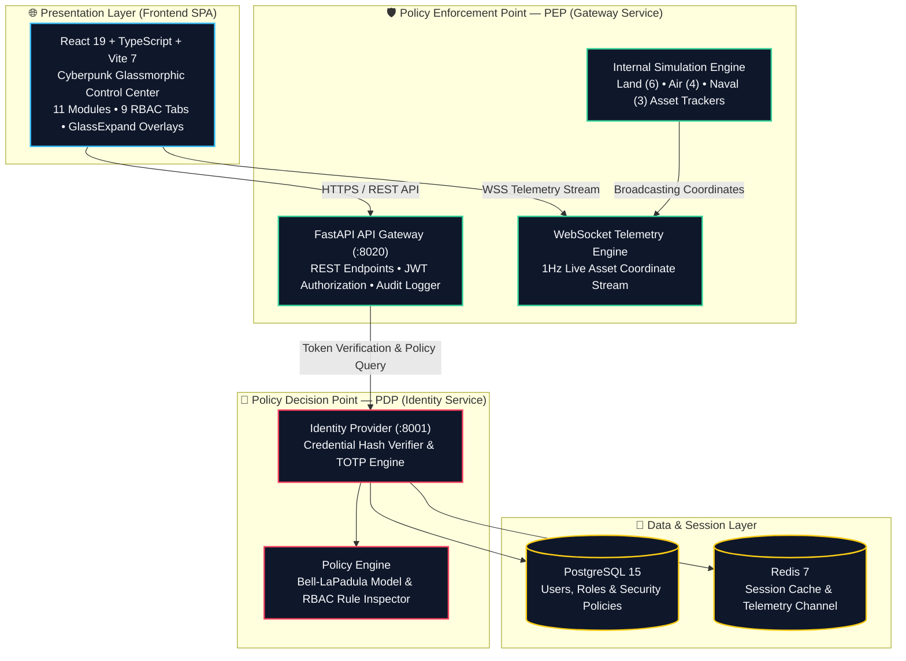
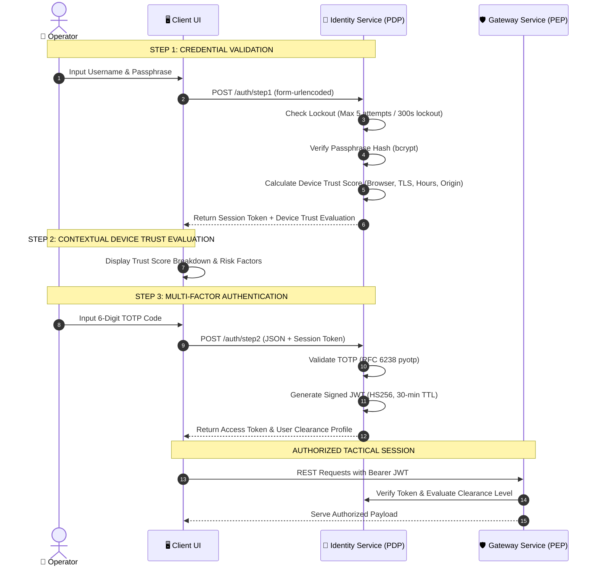

<div align="center">

# 🛡️ C5ISR Zero Trust Platform

### Military-Grade Command & Control Dashboard Built on Zero Trust Architecture
*Real-Time Situational Awareness • Bell-LaPadula MLS • Dynamic TOTP MFA • NIST SP 800-207*

<br/>

[](https://github.com/Shashivanth009/cztisr)
[](https://csrc.nist.gov/publications/detail/sp/800-207/final)
[](https://github.com/Shashivanth009/cztisr)
[](https://github.com/Shashivanth009/cztisr)

<p align="center">
  
  
  
  
  
  
  
  
</p>

---

</div>

## 🎯 Executive Summary

The **C5ISR Zero Trust Platform** is a unified command and control (C2) interface integrating **Combat Systems (C5)**, **Intelligence, Surveillance & Reconnaissance (ISR)**, and **Zero Trust Architecture (ZTA)** into a single pane of glass.

Designed under the **"Never Trust, Always Verify"** standard ([NIST SP 800-207](https://csrc.nist.gov/publications/detail/sp/800-207/final)), every inbound request undergoes 3-stage authentication (Passphrase $\rightarrow$ Contextual Device Trust $\rightarrow$ RFC 6238 TOTP MFA), continuous authorization via Mandatory Access Control (Bell-LaPadula MLS), and immutable audit trail generation.

```
+-----------------------------------------------------------------------+
|                         SYSTEM OPERATIONAL STATUS                      |
+-----------------------------------------------------------------------+
| DEFCON LEVEL     : 3 (ROUND HOUSE)                                    |
| POLICY ENGINE    : ARMED & ENFORCING (Bell-LaPadula + RBAC)          |
| AUTH PIPELINE    : 3-STEP (Creds -> Device Trust -> TOTP MFA)         |
| TELEMETRY STREAM : ACTIVE (1Hz WebSocket Battlespace Stream)          |
| DATA ENCRYPTION  : AES-256-GCM / TLS 1.3 / mTLS                        |
+-----------------------------------------------------------------------+
```

---

## 🏛️ System Architecture



---

## 🔒 3-Step Zero Trust Authentication Pipeline



---

## 🎛️ Feature & Tactical Component Catalog

### 🔴 Combat Systems (C5)

| Module | Component | Capabilities | Minimum Clearance |
|:---|:---|:---|:---:|
| **C1 — Command** | `CommanderDashboard.tsx` | DEFCON status indicator, live force counters, signal intel ticker, personnel tracking | `TOP_SECRET` |
| **C2 — Control** | `MissionControl.tsx` | Mission lifecycle CRUD (Planning $\rightarrow$ Active $\rightarrow$ Complete), priority & classification tagging | `TOP_SECRET` |
| **C3 — Computers** | `InfrastructureView.tsx` | Service mesh health monitoring, CPU/Memory resource telemetry, TLS/mTLS certificate tracking | `SECRET` |
| **C4 — Comms** | `Communications.tsx` | Encrypted channel management (HF, VHF, SATCOM), secure inter-operator messaging | `SECRET` |
| **C5 — Cyber** | `SOCDashboard.tsx` | Network traffic telemetry, MITRE ATT&CK threat mapping, CVE vulnerability scanner, interactive SOC terminal | `CONFIDENTIAL` |

### 🟢 Intelligence & Reconnaissance (ISR)

| Module | Component | Capabilities | Minimum Clearance |
|:---|:---|:---|:---:|
| **I — Intelligence** | `Intelligence.tsx` | Multi-INT reports (SIGINT, HUMINT, IMINT, OSINT, ELINT) with dynamic confidence scoring (0–100%) | `SECRET` |
| **S — Surveillance** | `SurveillanceRecon.tsx` | Sensor zone monitoring (Ground, Aerial, Naval, Satellite), active sensor counts, coverage heatmaps | `CONFIDENTIAL` |
| **R — Reconnaissance** | `SurveillanceRecon.tsx` | UAV (MQ-9 Reaper), Satellite (KH-11), and Ground Team telemetry (speed, fuel, imagery, targets) | `CONFIDENTIAL` |

### 🔵 Zero Trust Architecture (ZTA)

| Module | Component | Capabilities |
|:---|:---|:---|
| **Policy Engine** | `PolicyEngine.tsx` | Bell-LaPadula MLS rule verification, clearance level visualizer, RBAC matrix engine |
| **Audit Trail** | `AuditLog.tsx` | Immutable access log recording PERMIT/DENY decisions, risk scores (0–95), actor IDs, and timestamps |

---

## 👥 Role-Based Access Control (RBAC) Matrix

Access permissions strictly follow **Bell-LaPadula Mandatory Access Control (No Read Up)**:

| Tactical Module | COMMANDER | SOC_ANALYST | RED_TEAM | SOLDIER |
|:---|:---:|:---:|:---:|:---:|
| **C1 — Command** | ✅ Authorized | 🔒 Locked | 🔒 Locked | 🔒 Locked |
| **C2 — Control** | ✅ Authorized | 🔒 Locked | 🔒 Locked | 🔒 Locked |
| **C3 — Computers** | ✅ Authorized | ✅ Authorized | 🔒 Locked | 🔒 Locked |
| **C4 — Comms** | ✅ Authorized | ✅ Authorized | 🔒 Locked | 🔒 Locked |
| **C5 — Cyber Def** | ✅ Authorized | ✅ Authorized | ✅ Authorized | 🔒 Locked |
| **I — Intelligence** | ✅ Authorized | ✅ Authorized | 🔒 Locked | 🔒 Locked |
| **S/R — Recon** | ✅ Authorized | 🔒 Locked | ✅ Authorized | 🔒 Locked |
| **Zero Trust Policy** | ✅ Authorized | ✅ Authorized | 🔒 Locked | 🔒 Locked |
| **Audit Trail** | ✅ Authorized | ✅ Authorized | 🔒 Locked | 🔒 Locked |
| **Authorized Tabs** | **9 / 9** | **7 / 9** | **3 / 9** | **0 / 9** |

---

## 🛠️ Technology Stack

```
+-----------------------------------------------------------------------+
| FRONTEND     : React 19 • TypeScript 5.9 • Vite 7 • TailwindCSS 3     |
| UX / UI      : Framer Motion • Recharts • Lucide Icons • GlassExpand   |
| BACKEND      : FastAPI 0.109 • Pydantic 2.6 • Uvicorn • Asyncio      |
| AUTH & DATA  : python-jose (JWT) • passlib (bcrypt) • pyotp (TOTP)     |
| STORAGE      : PostgreSQL 15 • Redis 7 • asyncpg • SQLAlchemy       |
| INFRA        : Docker Compose • Render.com IaC • Vercel SPA          |
+-----------------------------------------------------------------------+
```

---

## 🚀 Quick Start

### Option A: Docker Compose (Recommended)

```bash
# 1. Clone repository
git clone https://github.com/Shashivanth009/cztisr.git
cd cztisr/c5isr-zero-trust

# 2. Launch 6-container stack
docker-compose up --build
```

**Local Endpoints:**
- 🖥️ **Frontend App**: `http://localhost:5173`
- 🛡️ **Gateway Service**: `http://localhost:8020`
- 🔑 **Identity Provider**: `http://localhost:8001`

---

### Option B: Manual Execution Setup

```bash
# Backend Setup
cd backend
pip install -r requirements.txt

# Terminal 1: Identity Service (PDP)
uvicorn identity.main:app --port 8001 --reload

# Terminal 2: Gateway Service (PEP)
uvicorn gateway.main:app --port 8020 --reload

# Frontend Setup (Terminal 3)
cd ../frontend
npm install
npm run dev
```

---

## 🔑 Demonstration Operator Credentials

Test dynamic RBAC tab-locking by logging in with different clearance tiers:

| Call-Sign | Username | Passphrase | Clearance Level | Tab Access |
|:---|:---|:---|:---|:---:|
| 🔴 **General Shepard** | `commander` | `password` | `TOP_SECRET` | **9 / 9** |
| 🟡 **Analyst Jack** | `analyst` | `password` | `SECRET` | **7 / 9** |
| 🟢 **Red Agent 1** | `redteam` | `password` | `CONFIDENTIAL` | **3 / 9** |

> 📲 **TOTP Setup**: Scan TOTP QR code at `GET /auth/totp/qr/{username}` or use your authenticator app code during Step 3 login.

---

## 📡 API Reference Summary

| Method | Endpoint | Description | Layer |
|:---:|:---|:---|:---:|
| `POST` | `/auth/step1` | Verify credentials & compute device trust score | PDP |
| `POST` | `/auth/step2` | Validate TOTP MFA code & issue signed JWT | PDP |
| `GET` | `/auth/totp/qr/{username}` | Generate TOTP QR code PNG stream | PDP |
| `POST` | `/policy/evaluate` | Evaluate Bell-LaPadula clearance & RBAC rules | PDP |
| `GET` | `/api/system-status` | DEFCON level, active missions, threat count | PEP |
| `GET` | `/api/missions` | Active mission catalog & progress stats | PEP |
| `GET` | `/api/infrastructure` | Service mesh health, CPU/Mem telemetry, TLS certs | PEP |
| `GET` | `/api/communications` | HF/VHF/SATCOM channel telemetry & encrypted log | PEP |
| `GET` | `/api/threats` | Active MITRE ATT&CK cyber threat database | PEP |
| `GET` | `/api/intelligence` | Multi-INT intelligence report stream | PEP |
| `GET` | `/api/surveillance` | Sensor zone coverage & heatmap alerts | PEP |
| `GET` | `/api/reconnaissance` | UAV & satellite flight paths & asset telemetry | PEP |
| `GET` | `/api/audit-logs` | Immutable audit log trail (PERMIT/DENY) | PEP |
| `WS` | `/ws/telemetry` | Real-time 1Hz WebSocket asset position stream | PEP |

---

## 🌐 Production Deployment

- **Backend (Render.com)**: Connect repo to Render Blueprint; it auto-executes `render.yaml` to spin up `c5isr-identity`, `c5isr-gateway`, and `c5isr-postgres`.
- **Frontend (Vercel)**: Import `frontend/` directory into Vercel, set `VITE_IDENTITY_URL`, `VITE_GATEWAY_URL`, and `VITE_WS_GATEWAY_URL` environment variables, and deploy.

---

<div align="center">

Built with 🛡️ by **[Shashivanth](https://github.com/Shashivanth009)**

<sub>NIST SP 800-207 • Bell-LaPadula MLS • RFC 6238 TOTP • AES-256-GCM</sub>

</div>
