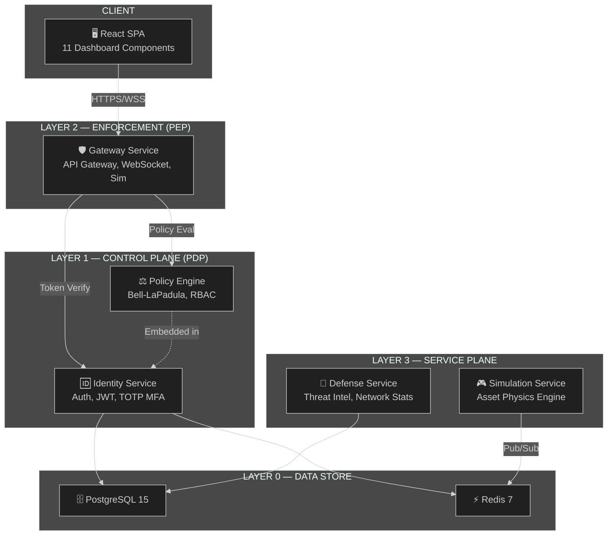
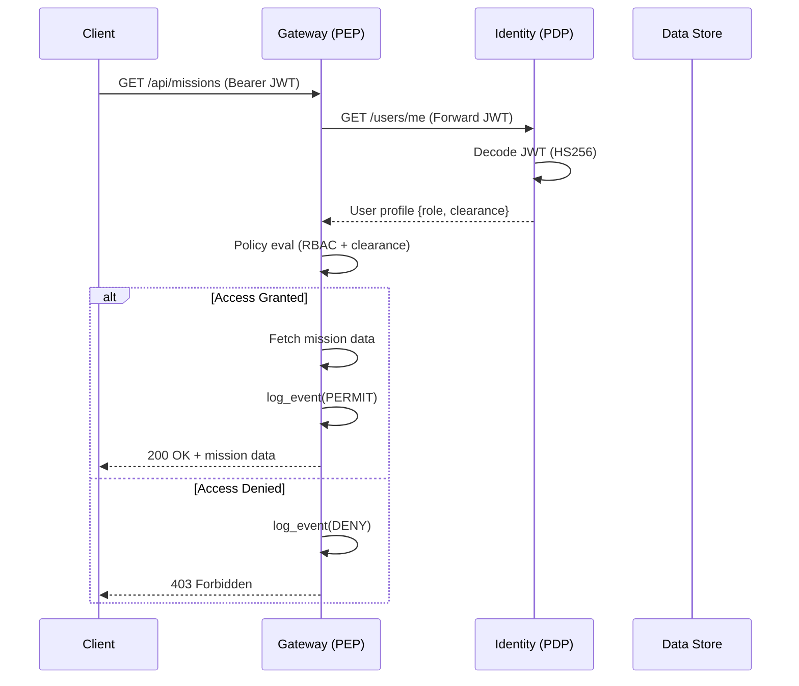
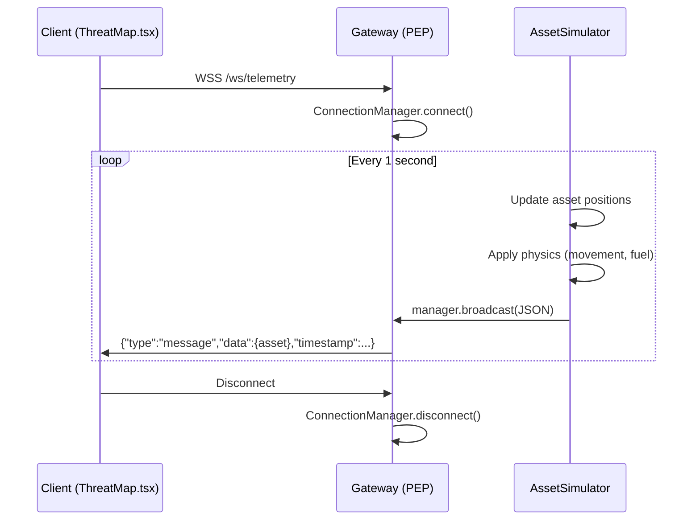
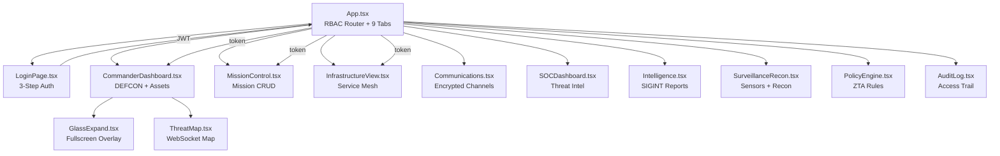

# 📐 C5ISR Zero Trust — Architecture Guide

> **NIST SP 800-207 Zero Trust Architecture** applied to a military C5ISR command and control platform.

---

## Table of Contents

- [System Overview](#system-overview)
- [Layer Architecture](#layer-architecture)
- [Service Catalog](#service-catalog)
- [Data Flow](#data-flow)
- [Authentication Pipeline](#authentication-pipeline)
- [Policy Engine Deep Dive](#policy-engine-deep-dive)
- [WebSocket Telemetry Protocol](#websocket-telemetry-protocol)
- [Frontend Component Architecture](#frontend-component-architecture)
- [Security Boundaries](#security-boundaries)
- [Service Interaction Matrix](#service-interaction-matrix)

---

## System Overview

The C5ISR Zero Trust Platform follows a **microservices architecture** with clear separation of concerns across 4 logical layers:



---

## Layer Architecture

### Layer 0 — Data Store

| Service | Technology | Purpose |
|:--------|:-----------|:--------|
| **PostgreSQL 15** | Alpine Docker image | Persistent storage for users, roles, policies, sessions |
| **Redis 7** | Alpine Docker image | Session cache, pub/sub for real-time telemetry |

**PostgreSQL Configuration:**
- Database: `c5isr_db`
- User: `admin`
- Health check: `pg_isready -U admin -d c5isr_db` (10s interval)

**Redis Configuration:**
- Single instance on port 6379
- Used for: Session tokens, telemetry pub/sub channel (`telemetry`)

### Layer 1 — Control Plane (PDP)

The **Policy Decision Point** is responsible for:

1. **Identity Verification** — Credential checking, password hashing (bcrypt), lockout management
2. **TOTP MFA** — RFC 6238 Time-based One-Time Passwords via `pyotp`
3. **Device Trust Scoring** — Browser detection, TLS validation, access time, origin verification
4. **JWT Issuance** — HS256 tokens with 30-minute TTL containing `sub`, `role`, `clearance`
5. **Policy Evaluation** — Bell-LaPadula clearance checks, RBAC role checks

**Key Endpoints:**
- `POST /auth/step1` — Credential verification (returns session token)
- `POST /auth/step2` — TOTP verification (returns JWT)
- `POST /policy/evaluate` — Access decision (PERMIT/DENY)

### Layer 2 — Enforcement (PEP)

The **Policy Enforcement Point** is the single entry point for all client requests:

1. **API Gateway** — 16 REST endpoints serving dashboard data
2. **WebSocket Server** — `/ws/telemetry` for real-time asset position streaming
3. **Embedded Simulator** — Land (6), Air (4), Naval (3) asset physics engine
4. **Traffic Generator** — Background task simulating audit log events (90% valid, 10% threats)
5. **Token Verification** — Forwards JWT to Identity Service for validation

### Layer 3 — Service Plane

| Service | Function |
|:--------|:---------|
| **Defense Service** | Threat intelligence database (3 active threats), network stats, vulnerability scanning |
| **Simulation Service** | Redis pub/sub asset physics — Land (5), Air (3), Naval (2) with 1Hz tick rate |

---

## Data Flow

### Request Lifecycle



### WebSocket Telemetry Flow



---

## Authentication Pipeline

### 3-Step Zero Trust Authentication

```
┌─────────────────────────────────────────────────────────────────────┐
│                    AUTHENTICATION PIPELINE                          │
│                                                                     │
│  STEP 1: CREDENTIALS                                               │
│  ├── Client sends username + password (form-urlencoded)            │
│  ├── Server checks lockout (5 attempts → 300s ban)                 │
│  ├── Server verifies bcrypt hash (passlib)                         │
│  ├── Server evaluates device trust (4 factors → 0-100 score)      │
│  └── Returns: session_token + device_trust + user_info             │
│                                                                     │
│  STEP 2: DEVICE TRUST EVALUATION (Frontend Only)                   │
│  ├── Animated display of trust score                               │
│  ├── Factor breakdown: Browser, TLS, Hours, Origin                 │
│  └── Auto-advances after 2.5 seconds                               │
│                                                                     │
│  STEP 3: TOTP MFA                                                   │
│  ├── Client sends 6-digit TOTP code + session_token                │
│  ├── Server verifies via pyotp (valid_window=1 for clock drift)    │
│  ├── Server creates JWT (HS256, 30min TTL)                         │
│  ├── Server records active session                                  │
│  └── Returns: access_token + user profile                          │
│                                                                     │
│  RESULT: JWT containing {sub, role, clearance, exp}                │
└─────────────────────────────────────────────────────────────────────┘
```

### Device Trust Scoring Algorithm

| Factor | Pass Condition | Impact |
|:-------|:---------------|:------:|
| Known Browser | User-Agent contains Chrome/Firefox/Safari/Edge | +15 |
| Unrecognized Client | User-Agent doesn't match known browsers | -10 |
| Transport Security (TLS) | `x-forwarded-proto: https` or localhost | +10 |
| Insecure Transport | HTTP without proxy headers | -10 |
| Normal Hours Access | UTC hour between 06:00–22:00 | +10 |
| Off-Hours Access | UTC hour outside 06:00–22:00 | -15 |
| Trusted Origin | Origin matches `ALLOWED_ORIGINS` list | +15 |

**Base Score:** 50 &nbsp;|&nbsp; **Range:** 0–100 &nbsp;|&nbsp; **Risk Levels:** LOW (≥70), MEDIUM (≥40), HIGH (<40)

---

## Policy Engine Deep Dive

### Bell-LaPadula Model (No Read Up)

The policy engine implements the **Simple Security Property** of the Bell-LaPadula model:

```python
clearance_map = {
    UNCLASSIFIED: 0,
    CONFIDENTIAL: 1,
    SECRET: 2,
    TOP_SECRET: 3
}

# Rule: subject.clearance >= resource.classification
if user_level < resource_level:
    return DENY  # No Read Up violation
```

### RBAC Matrix

The frontend enforces a **Role-Based Access Control** matrix:

| Tab | COMMANDER | SOC_ANALYST | RED_TEAM | SOLDIER |
|:----|:---------:|:-----------:|:--------:|:-------:|
| C1 — Command | ✅ | ❌ | ❌ | ❌ |
| C2 — Control | ✅ | ❌ | ❌ | ❌ |
| C3 — Computers | ✅ | ✅ | ❌ | ❌ |
| C4 — Comms | ✅ | ✅ | ❌ | ❌ |
| C5 — Cyber Def | ✅ | ✅ | ✅ | ❌ |
| I — Intelligence | ✅ | ✅ | ❌ | ❌ |
| S/R — Surv & Recon | ✅ | ❌ | ✅ | ❌ |
| ZT — Zero Trust | ✅ | ✅ | ❌ | ❌ |
| AL — Audit Log | ✅ | ✅ | ❌ | ❌ |

**Total Tabs:** COMMANDER=9/9 | SOC_ANALYST=7/9 | RED_TEAM=3/9 | SOLDIER=0/9

---

## WebSocket Telemetry Protocol

### Message Format

```json
{
  "type": "message",
  "data": {
    "id": "LAND-100",
    "lat": 34.0123,
    "lng": 65.0456,
    "status": "OPERATIONAL",
    "fuel": 97.5,
    "type": "land"
  },
  "timestamp": 1707912345.678
}
```

### Asset Types & Physics

| Type | Count | Movement Speed | Status Events |
|:-----|:-----:|:--------------:|:-------------:|
| Land | 6 | 0.005°/tick | 0.5% chance per tick |
| Air | 4 | 0.02°/tick | 0.5% chance per tick |
| Naval | 3 | 0.02°/tick | 0.5% chance per tick |

**Tick Rate:** 1 Hz (1 update per second per asset)  
**Fuel Consumption:** 0.05 units/tick  
**Possible Statuses:** OPERATIONAL, ENGAGED, MAINTENANCE, OFFLINE

---

## Frontend Component Architecture



### State Management

- **No Redux/Zustand** — Uses React's built-in `useState` and `useEffect` hooks
- **Token passed as prop** — `token` prop flows from `App.tsx` to all dashboard components
- **RBAC filtering** — `useMemo` computes allowed/denied tabs based on `user.role`

---

## Security Boundaries

```
┌─────────────────────────────────────────────────────────────┐
│                    TRUST BOUNDARY 1                          │
│                 (Public Internet)                            │
│  ┌──────────────────────────────────┐                       │
│  │  React SPA (Vercel)              │                       │
│  │  ● No secrets embedded           │                       │
│  │  ● RBAC enforced in UI only      │                       │
│  │  ● All data from API calls       │                       │
│  └──────────────┬───────────────────┘                       │
│                 │ HTTPS/WSS                                  │
├─────────────────┼───────────────────────────────────────────┤
│                 │ TRUST BOUNDARY 2                           │
│                 │ (Service Mesh)                             │
│  ┌──────────────▼───────────────────┐                       │
│  │  Gateway PEP (Render)            │                       │
│  │  ● JWT validation on every req   │                       │
│  │  ● Policy enforcement            │                       │
│  │  ● Audit logging                 │                       │
│  └──────────────┬───────────────────┘                       │
│                 │ Internal HTTP                              │
│  ┌──────────────▼───────────────────┐                       │
│  │  Identity PDP (Render)           │                       │
│  │  ● Credential storage            │                       │
│  │  ● Token issuance                │                       │
│  │  ● Policy decision               │                       │
│  └──────────────┬───────────────────┘                       │
│                 │                                            │
├─────────────────┼───────────────────────────────────────────┤
│                 │ TRUST BOUNDARY 3                           │
│                 │ (Data Layer)                               │
│  ┌──────────────▼───────────────────┐                       │
│  │  PostgreSQL + Redis              │                       │
│  │  ● Network-isolated              │                       │
│  │  ● Credentials in env vars       │                       │
│  └──────────────────────────────────┘                       │
└─────────────────────────────────────────────────────────────┘
```

---

## Service Interaction Matrix

| Source → Target | Identity | Gateway | Defense | Simulation | PostgreSQL | Redis |
|:----------------|:--------:|:-------:|:-------:|:----------:|:----------:|:-----:|
| **Frontend** | Auth | REST/WS | — | — | — | — |
| **Identity** | — | — | — | — | R/W | R/W |
| **Gateway** | Verify | — | — | — | — | R |
| **Defense** | — | — | — | — | R | R |
| **Simulation** | — | — | — | — | — | Pub |

**Legend:** R = Read, W = Write, Pub = Publish, Auth = Authentication, Verify = Token Verification

---

<div align="center">
  <sub>📐 Architecture documentation for C5ISR Zero Trust Platform</sub>
</div>
