# 🌐 C5ISR Zero Trust — Deployment Guide

> Deploy the C5ISR Zero Trust Platform to production using Docker, Render.com, and Vercel.

---

## Table of Contents

- [Deployment Architecture](#deployment-architecture)
- [Docker Compose (Local)](#docker-compose-local)
- [Backend → Render.com](#backend--rendercom)
- [Frontend → Vercel](#frontend--vercel)
- [Environment Variables](#environment-variables)
- [Health Checks](#health-checks)
- [Troubleshooting](#troubleshooting)

---

## Deployment Architecture

```mermaid
%%{init: {'theme': 'dark'}}%%
graph TB
    subgraph USERS["👤 Users"]
        BROWSER["Browser"]
    end

    subgraph VERCEL["▲ Vercel"]
        FE["React SPA<br/>Static Build"]
    end

    subgraph RENDER["☁️ Render.com"]
        ID["c5isr-identity<br/>Docker"]
        GW["c5isr-gateway<br/>Docker"]
        PG["c5isr-postgres<br/>Managed DB"]
    end

    BROWSER -->|"HTTPS"| FE
    FE -->|"HTTPS REST"| GW
    FE -->|"WSS"| GW
    GW -->|"Internal"| ID
    ID --> PG

    style VERCEL fill:#0d1117,stroke:#00d9f9,stroke-width:2px
    style RENDER fill:#0d1117,stroke:#00ff9d,stroke-width:2px
```



---

## Docker Compose (Local)

### Prerequisites

- Docker Engine ≥ 20.10
- Docker Compose v2+

### Quick Start

```bash
# Clone and navigate
git clone https://github.com/Shashivanth009/cztisr.git
cd cztisr/c5isr-zero-trust

# Build and start all 6 services
docker-compose up --build

# Detached mode
docker-compose up --build -d

# View logs
docker-compose logs -f

# Stop all services
docker-compose down

# Stop and remove volumes
docker-compose down -v
```

### Service Map

| Container | Image | Port | Health Check |
|:----------|:------|:----:|:-------------|
| `c5isr-postgres` | `postgres:15-alpine` | 5432 | `pg_isready -U admin -d c5isr_db` |
| `c5isr-redis` | `redis:7-alpine` | 6379 | `redis-cli ping` |
| `c5isr-identity` | Custom Dockerfile | 8001→8000 | Depends on postgres + redis |
| `c5isr-gateway` | Custom Dockerfile | 8020→8000 | Depends on identity + redis |
| `c5isr-defense` | Custom Dockerfile | — | Depends on gateway |
| `c5isr-simulation` | Custom Dockerfile | — | Internal only |

### Startup Order

```
PostgreSQL → Redis → Identity → Gateway → Defense → Simulation
```

Health checks ensure PostgreSQL and Redis are ready before starting dependent services.

---

## Backend → Render.com

### Step 1: Push to GitHub

Ensure your repository is pushed to GitHub with the `render.yaml` file at the project root.

### Step 2: Create Blueprint

1. Go to [Render Dashboard](https://dashboard.render.com)
2. Click **New** → **Blueprint**
3. Connect your GitHub repository
4. Render auto-detects `render.yaml`

### Step 3: Services Created

The blueprint creates:

| Service | Type | Plan | Notes |
|:--------|:-----|:-----|:------|
| `c5isr-postgres` | Database | Free | Auto-connected via `connectionString` |
| `c5isr-identity` | Web Service | Free | Docker runtime, `/health` check |
| `c5isr-gateway` | Web Service | Free | Docker runtime, `/health` check |

### Step 4: Environment Variables

The `render.yaml` handles most variables automatically:

- `DATABASE_URL` — Auto-populated from `c5isr-postgres` connection string
- `JWT_SECRET` — Auto-generated secure value
- `IDENTITY_SERVICE_URL` — Auto-populated from `c5isr-identity` hostport

### Step 5: Verify Deployment

```bash
# Check Identity Service
curl https://c5isr-identity.onrender.com/health

# Check Gateway Service  
curl https://c5isr-gateway.onrender.com/health
```

---

## Frontend → Vercel

### Step 1: Import Repository

1. Go to [Vercel Dashboard](https://vercel.com/dashboard)
2. Click **Add New** → **Project**
3. Import from GitHub
4. Set **Root Directory** to `frontend`
5. Framework preset: **Vite**

### Step 2: Environment Variables

Set these in Vercel's **Settings → Environment Variables**:

| Variable | Value | Description |
|:---------|:------|:------------|
| `VITE_IDENTITY_URL` | `https://c5isr-identity.onrender.com` | Identity service URL |
| `VITE_GATEWAY_URL` | `https://c5isr-gateway.onrender.com` | Gateway service URL |
| `VITE_WS_GATEWAY_URL` | `wss://c5isr-gateway.onrender.com` | WebSocket gateway URL |

> **Important:** Use `wss://` (not `ws://`) for the WebSocket URL in production.

### Step 3: Deploy

Click **Deploy**. Vercel will:
1. Install dependencies (`npm install`)
2. Build the project (`tsc -b && vite build`)
3. Deploy the `dist/` folder as a static SPA

### Step 4: SPA Routing

The `vercel.json` handles client-side routing:

```json
{
  "rewrites": [
    { "source": "/(.*)", "destination": "/index.html" }
  ]
}
```

---

## Environment Variables

### Backend (Identity Service)

| Variable | Default | Description |
|:---------|:--------|:------------|
| `SECRET_KEY` | `supersecretkey` | JWT signing secret |
| `DATABASE_URL` | `postgresql://admin:...` | PostgreSQL connection |
| `REDIS_URL` | `redis://redis:6379/0` | Redis connection |
| `ALLOWED_ORIGINS` | `localhost,...` | CORS allowed origins |
| `SMTP_EMAIL` | — | Optional email for alerts |
| `SMTP_PASSWORD` | — | Optional email password |

### Backend (Gateway Service)

| Variable | Default | Description |
|:---------|:--------|:------------|
| `IDENTITY_SERVICE_URL` | `http://identity-service:8000` | Identity service URL |
| `SECRET_KEY` | `supersecretkey` | Shared JWT secret |
| `REDIS_URL` | `redis://redis:6379/0` | Redis connection |

### Frontend

| Variable | Default | Description |
|:---------|:--------|:------------|
| `VITE_IDENTITY_URL` | `http://localhost:8001` | Identity service URL |
| `VITE_GATEWAY_URL` | `http://localhost:8020` | Gateway service URL |
| `VITE_WS_GATEWAY_URL` | `ws://localhost:8020` | WebSocket URL |

---

## Health Checks

### Monitoring Endpoints

```bash
# Identity Service
curl http://localhost:8001/health
# → {"status": "IDENTITY PROVIDER OPERATIONAL", "mfa": true, ...}

# Gateway Service
curl http://localhost:8020/health
# → {"status": "C5ISR GATEWAY OPERATIONAL", "zero_trust": true, ...}

# PostgreSQL
docker exec c5isr-postgres pg_isready -U admin -d c5isr_db

# Redis
docker exec c5isr-redis redis-cli ping
# → PONG
```

---

## Troubleshooting

### Common Issues

| Problem | Cause | Solution |
|:--------|:------|:---------|
| `Identity Service unavailable` | Gateway can't reach Identity | Check `IDENTITY_SERVICE_URL` env var |
| `CORS error` | Origin not in allowed list | Add origin to `ALLOWED_ORIGINS` |
| `WebSocket disconnects` | Render free tier sleeps | Upgrade to paid plan or use keep-alive pings |
| `TOTP code invalid` | Clock drift > 30s | Sync device clock, or increase `valid_window` |
| `Account locked` | 5 failed login attempts | Wait 300 seconds or restart Identity service |

### Render Free Tier Limitations

- Services sleep after 15 minutes of inactivity
- First request after sleep takes ~30 seconds (cold start)
- PostgreSQL free tier has 1GB storage limit

### Debug Commands

```bash
# View all container logs
docker-compose logs -f

# View specific service logs
docker-compose logs -f identity-service
docker-compose logs -f gateway-service

# Access PostgreSQL
docker exec -it c5isr-postgres psql -U admin -d c5isr_db

# Access Redis
docker exec -it c5isr-redis redis-cli

# Rebuild a specific service
docker-compose up --build identity-service
```

---

<div align="center">
  <sub>🌐 Deployment documentation for C5ISR Zero Trust Platform</sub>
</div>
